= Fortigate VPN SSL Hardening Guide
:source-highlighter: rouge
:title: Fortigate VPN SSL Hardening Guide
:date: 2023-03-15 09:55:25+00:00
:toc:

Last updated: 19.03.2023

== Introduction
This guide is the result of closely following Fortigate VPN SSL vulnerabilities
over the years, actual cases of compromised firewalls, operational manuals and
reports of multiple gangs (e.g. _Conti manuals_) and my experience with Fortigates
of 15+ years and counting. By implementing all/some of the measures below you
will make your SSL VPN on Fortigate substantially harder to break in and thus less
attractive to the attackers.  

 
== Change the default SSL VPN port 10443/443 to anything else
This security by obscurity  actually works. In most cases, the attackers do
not target specific companies, but are looking for low hanging fruit. And the
easiest way to do so is to scan for known ports/services. And both, 443 and 10443, are
well known Fortigate listening ports. It is even easier - just search
Shodan/Censys for "Fortigate" and currently Shodan has 185K results for port
10443, and Censys 317K. That was what happened with a large VPN
credentials leak 2 years ago
https://www.linkedin.com/pulse/50000-vpn-usernames-passwords-from-fortigates-around-we-slobodyanyuk/
- all of the affected Fortigates were listening on either 443 or 10443 ports. 

The possible downside can be that VPN users connecting via WiFi in hotels/caffe
may have outgoing ports blocked except 443, but with cellular packages being so
cheap today, it is viable for them to use their phone as hotspot for VPN
connectionis and avoid using public WiFi altogether.

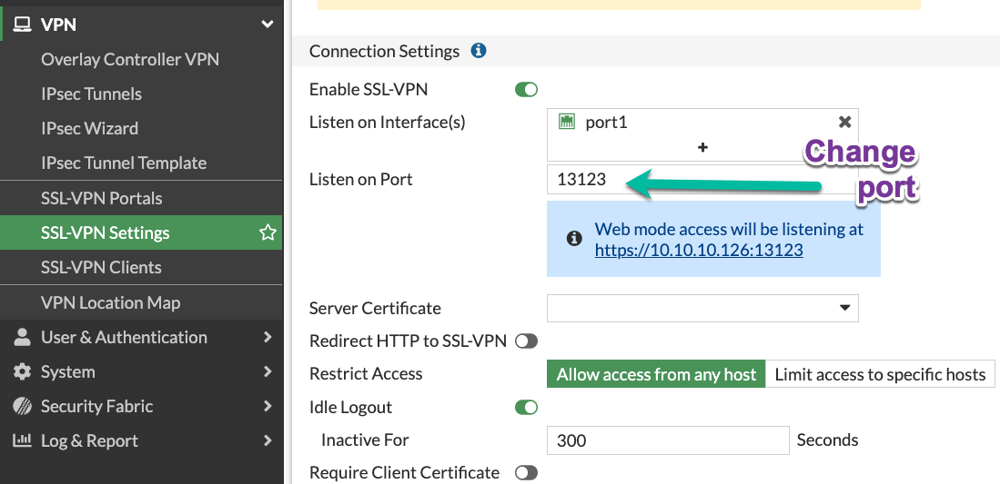

On the CLI:

----
config vpn ssl settings
    set port 13123
----

== Do not use local users for authentication, and if using - keep passwords elsewhere or/and  enable MFA
In general, keeping all the security info in one box (Fortigate here) is a bad
practice. The mentioned vulnerability CVE-2018-13379  affected only Fortigates
with local VPN users having local authentication. Additionally, you give up
password policies, centralized system to expire/change passwords,
non-repeatability of the passwords etc. with such locally authenticated on the
Fortigate users. Integrating user authentication with existing user database
(LDAP/Active Directory/Cloud AD) is a breeze in Fortigate. 

== Enable Multi-Factor Authentication for VPN users
ANY form of MFA will be better than none. Hardware Fortigate come with 2 mobile 
application FortiTokens for free. Additionally, you can use SMS as MFA, but will
cost you money, or email that is completely free. 
The email as MFA is not visible nor enabled by default, so I wrote a short guide
how to use  it 
https://yurisk.info/2020/03/01/fortigate-enable-e-mail-as-mfa-and-increase-token-validity-time/[enable e-mail as a two-factor authentication for a user and increase token timeout]

And of course, any 3rd party providing MFA can be used via RADIUS protocol
(Okta/Azure/Duo/etc.)

There is also option of _client_ PKI certificates as MFA, which is quite secure,
but also is most complex in setting up of all. Client certificates do not work
together with SAML authentication (Azure/etc.), which is also a disadvantage. 

== Limit access to VPN SSL portal to specific IP addresses

If your users happen to have static IP addresses assigned by their ISP, it is an excellent way to
limit exposure of VPN SSL portal.

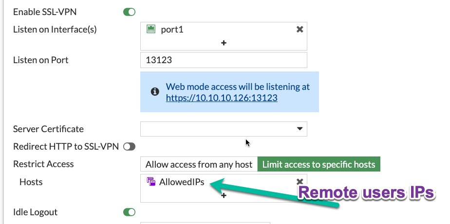

== Move VPN SSL listening interface to a Loopback interface
This step will give an additional security control - Security Rule.
The benefits of which are:

* The rule is highly visible, not hidden in CLI as Local-in Policy.
* It will have detailed traffic & security logs. 
* It enables to turn SSL VPN access on and off on a time schedule.
* Allows us to disable SSL VPN access in one click (just disable this security
rule) without deleting anything.
* Makes possible to use ISDB address objects (See below on blocking Tor Exit
Nodes).
* And finally, as  SSL VPN is NOT hardware-accelerated on any Fortigate, no matter where it
is set, on physical or Loopback interface,  no reason to avoid Loopback here.

To set it up:

* Create a Loopback interface (here _Loop33_ with IP of _13.13.13.13_, not shown)
* Enable VPN SSL on this Loopback in VPN SSL Settings:

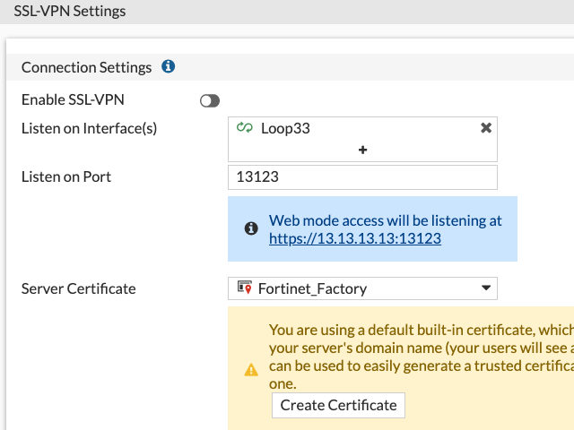

* Allow access to the Loopback on the listening port from the Internet. I use _all_ as a
source (rule id _2_) 
here, but see other recommendations on limiting source IP for finer control:

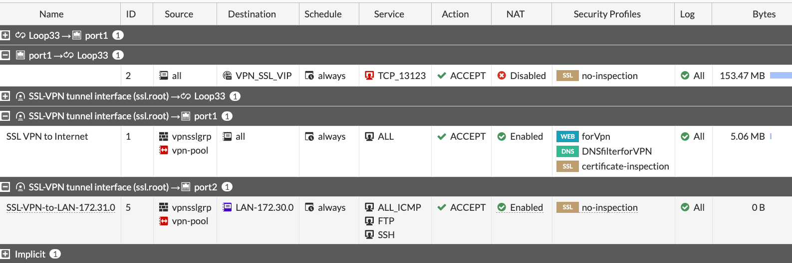

== (Less preferred than above) Limit access to SSL VPN portal in Local-in Policy
The idea here is that unlike limits in the VPN SSL Settings, limits in the
Local-in Policy come before any traffic reaches VPN SSL daemon. Starting with
FortiOS 7.2 we can also use in Local-in Policies GeoIP objects, external feeds (I
haven't seen much benefit in them though). As I mentioned above, due to CLI-only
nature of the Local-in Policy, it is more manageable to use rather Loopback for
SSL VPN connections. But Local-in policy can do the job as well, see some
examples of using it here
https://yurisk.info/2022/07/04/fortigate-local-in-policy-configuration-examples-for-vpn-ipsec-vpn-ssl-bgp-and-more/[Fortigate Local-in policy configuration examples for VPN IPSec, VPN SSL, BGP and more] and https://yurisk.info/2020/06/07/fortigate-local-in-policy/[Fortigate Local in Policy what it does and how to change/configure it]

== Limit access to portal by GeoIP location
When your users are located in a specific country(s), it is advisable to at
least limit access to the VPN to those countries. E.g. for users coming from
Israel:

* Create an address of type _Geography_:

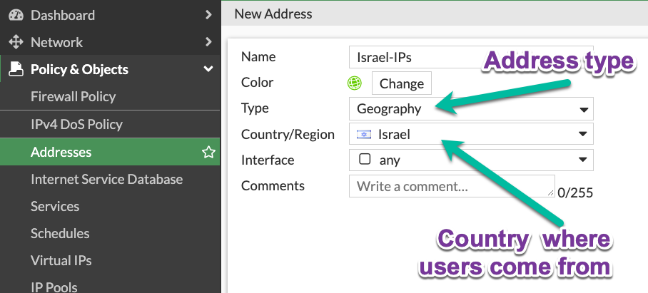

* Use it in VPN SSL Settings:

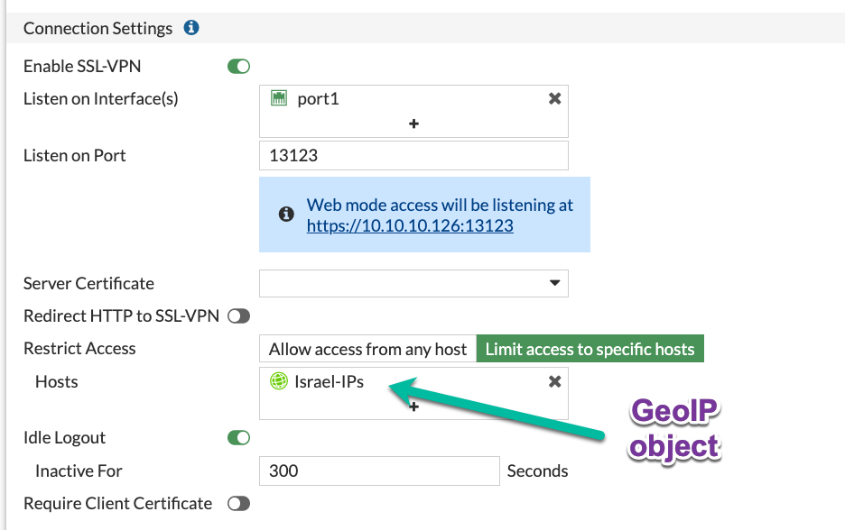

The option to use Geo objects appeared in newer FortiOS, so if you have an older 
version, moving SSL VPN to loopback interface will give you this option.

== Block access to/from Tor Exit Nodes and Relays to anything
Attackers using Tor are pretty much untraceable, so this motivates them to
brute-force from Tor network a lot. Again, it is possible to implement only when your SSL VPN is listening on the Loopback
interface - neither VPN Settings, nor Local-in Policy accept ISDB addresses so
far. Just use the ISDB objects for Tor Exit Nodes and Relays, and VPN
Anonymizers in the
security rule that is above the VPN SSL rule to block them.

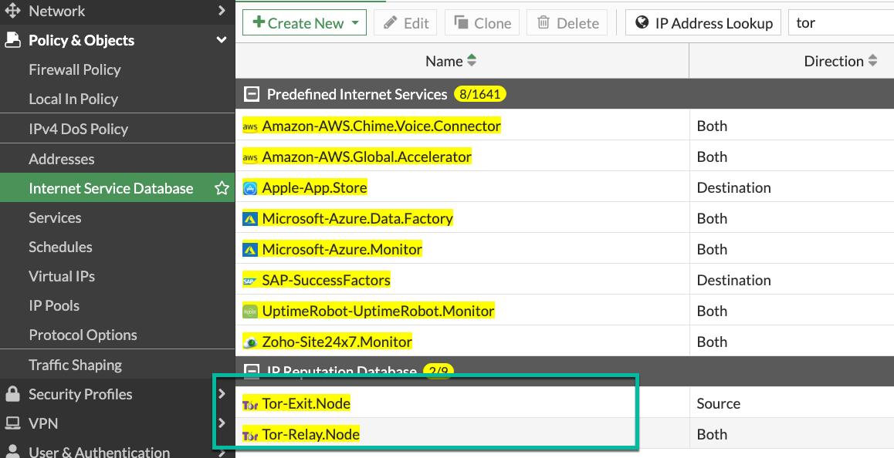

Security Rule to block access from Tor to the Loopback interface where SSL VPN
is listening:

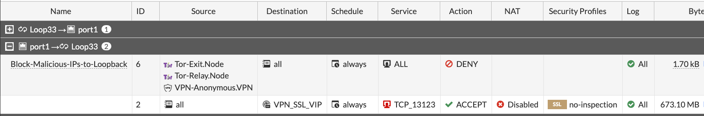

== Install trusted CA-issued certificate, but don't issue Let's Encrypt certificates directly on the Fortigate  

Users, and people in general, are suspicious of anything strange/new/unknown. If
 they get used to a valid TLS certificate from a trusted CA Authority on each
login into VPN SSL, they will immediately catch the browser error when being
exposed to Man-in-the-middle attack. Users are your friends, just teach them
good habits and they will be your allies. 

_Let's encrypt_ certificates - yes, they are free and trusted. But, issuing them
directly on the Fortigate has 2 disadvantages: 

. It enables _Acme_ protocol daemon to listen on port 80, and it HAS to be open
from ANY for auto-renewal to work, and exposing any additional daemon to the
Internet is a bad idea. To be exact - you need to have port 80 open only for the
period of issuing/renewing the certificate. So, you may, if you want to, enable
incoming port 80 from any when requesting certificate, then close the port until
time comes to renew it. But then it is no different from manually requesting and
importing.
. It does not support requesting _wildcard_ certificates, only a specific
subdomain one. And this has additional downside - your VPN subdomain gets logged
on the Internet for everyone to see. Just search here
https://crt.sh/?q=yurisk.com 

I do use Let's Encrypt certificates, but on a separate
Linux server from which I export then import the certificates to the Fortigate
manually.
 
 
== Configure email alert on each successful VPN SSL connection
Why on successful and not failed? The real-life experience proves that 
after _nth_ alert on failed login in a day, people stop looking at them 
at all. And in my opinion, the successful log in is more important than the
failed one. 
I am working on a collection of automation stitches that will include also this 
email alert, follow me for updates on this.

== Prevent re-using the same user account to connect in parallel

You can, by default, connect with the same VPN user from different locations at
the same time. To somewhat improve on this, disable simultaneous logins for
users. This way, the connected user will be disconnected when someone else logs
in with his/her credentials - this would alert the user that something fishy is
going on. You set this feature per Portal.

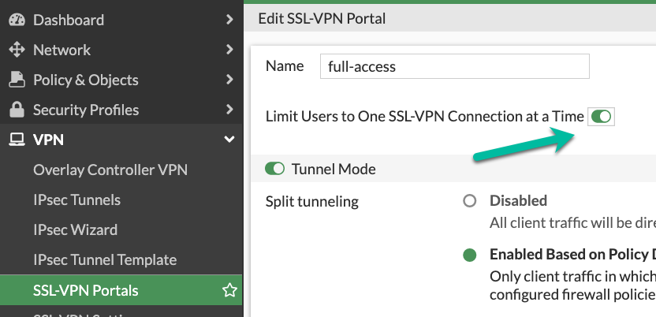

On CLI:

----
config vpn ssl web portal
    edit "full-access"
        set limit-user-logins enable
end
----

== In security rules, allow access only to specific destinations and services, not _all_
I see it many times - to save few clicks, admins put in the _Destination_ column
of the SSL VPN security rule _all_/whole LAN, instead of specific host(s) with
specific services. If attackers get hold of VPN connection to the Fortigate,
they will mass scan internal LAN for AD Domain Controllers, SMB shares,
enumerate all hosts and none of this will happen if you harden the VPN Remote
Access rules to specific services and hosts. 

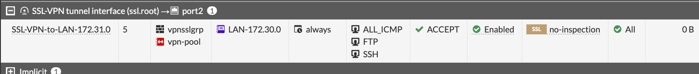

== If not using VPN SSL, disable it, or assign to a dummy interface
The VPN SSL setting is *on* by default, which is ok - as long as there is no
listening interface assigned to it and no security rules using `ssl.root`
exist, the service will NOT listen actually. On some FortiOS versions you have
to do it on CLI. If you want to disable temporarily SSL VPN without deleting
anything, you could, besides clicking on _Disable_, assign it a Loopback
interface which you also put in a _Down_ state.  

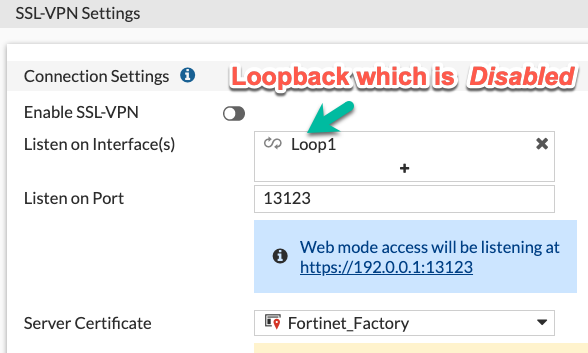

On CLI:

----
config vpn ssl settings
    set status disable
    set source-interface Loop1
end
----

== Create a no-access portal and set it as default in the VPN settings
Once you have VPN SSL enabled, you *have* to specify the default portal 
to which all unmapped to portals users will be assigned. To prevent unintended
users/groups connecting via this default portal, create the one disabling all
the access inside it and then set it as the default.

* Create a portal with no factual access:

----
config vpn ssl web portal
    edit DefaultNoAccess
        set tunnel-mode disable 
        set web-mode disable
        set ipv6-tunnel-mode disable
    next
end
----

* Make it the default portal:

----
config vpn ssl setting
        set default-portal DefaultNoAccess
end
----

IMPORTANT: Make sure you have the relevant users/groups mapped to other, working portals, before doing this.

== Block offending IP after _n_ failed attempts
This slows down brute-force and scanning attacks on VPN SSL. This feature is on 
by default, but the block duration is just 60 seconds. You will want to 
tune it to your environment and users. I usually set number of failed login
attempts to 3, then block the offender for 10 minutes. In many cases it was
enough for accidental attackers to give up and move to another target. 

This can be configured in CLI:

----
config vpn ssl settings
    set login-attempt-limit 3
    set login-block-time 600
end
----

Here I block the IP for 10 minutes after 3 unsuccessful authentication attempts. 
The maximum duration of blocking is 86400 seconds, or 24 hours.

== Disable weak and outdated TLS protocols for SSL VPN
Even with newer FortiOS versions VPN SSL by default supports TLS 1.1, and TLS
1.2 versions that are outdated and recommended against usage everywhere. You can
set SSL VPN to use only TLS 1.2 & 1.3 (on CLI only) with this command ( I
thought of recommending to leave just TLS 1.3, but Forticlient is currently having
problems with using it on Windows 10 & 11, so not for now):

----
config vpn ssl settings
        set ssl-min-proto-ver tls1-2 
end
----

And make sure it worked:

----
curl -v https://vpn.yurisk.com:13123 --tlsv1.1  -o /dev/null

* Connected to vpn.yurisk.com (52.58.153.81) port 13123 (#0)
* ALPN, offering h2
* ALPN, offering http/1.1
* successfully set certificate verify locations:
*   CAfile: /etc/ssl/certs/ca-certificates.crt
  CApath: /etc/ssl/certs
} [5 bytes data]
* TLSv1.1 (OUT), TLS handshake, Client hello (1):
} [140 bytes data]
* TLSv1.1 (IN), TLS alert, Server hello (2):
{ [2 bytes data]
* error:1409442E:SSL routines:ssl3_read_bytes:tlsv1 alert protocol version
* stopped the pause stream!
* Closing connection 0
curl: (35) error:1409442E:SSL routines:ssl3_read_bytes:tlsv1 alert protocol
version
----

NOTE: This will prevent older browsers/Forticlients from connecting, but we talk
about _very_ old versions, like Internet Explorer 11, or Chrome version 50
(current one is 110). So it should not be a problem.

== Consider switching from VPN SSL to VPN IPSec for clients
A bit drastic, but in all those years of VPN SSL vulnerabilities happening, I
remember of no single critical CVE for the IPSec daemon in Fortigate. Yes, it is more
involved in configuring it, but it may well be worth the effort. You use on the
client side the same Forticlient.

== Consider moving VPN SSL into its own VDOM
This is a measure against the worst case scenario - remotely executable 0-day
happens in the SSL VPN daemon, and attackers break into your Fortigate. In this
scenario the attackers will most probably create their own admin users for
persistence, set up VPN for remote access with rules permitting _Any_ to the
internal LAN, and if not trying to hide - will delete/remove your admin user to
block you access to the Fortigate. If this happens with the Fortigate that all
your DMZ/LAN/Storage/Backup networks are connected to, the game is over. But if
the same happens to the Internet-facing VDOM that has only SSL VPN configs and
rules, well, maximum they will have access to is anything you explicitly allowed
in rules between VDOMs. And if you implemented specific rules to allow specific
protocols to specific hosts, that would be not much of a gain to the attackers.
And all Fortigate models except the smallest ones, have hardware acceleration on
their inter-VDOM links, so perfomance-wise you lose nothing as well.
And price-wise, every Fortigate (even the smallest 40F) includes 10 VDOMs for free.

 
== Additional Resources to follow
* https://www.fortiguard.com/psirt Fortinet announcements on new vulnerabilities.
* https://yurisk.info/category/fortigate.html My blog's Fortigate category, has RSS feed
* https://t.me/fortichat Fortinet-related Telegram group with experts (Russian language)
* https://community.fortinet.com/ Fortinet Community Forum, a lot of Fortinet TAC folks hang out there.
* https://www.reddit.com/r/fortinet/ Well, Reddit is Reddit.
